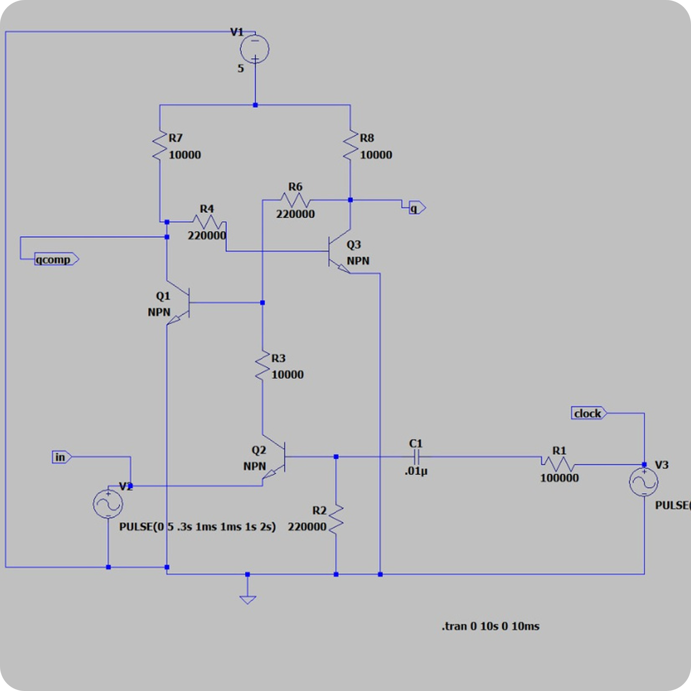
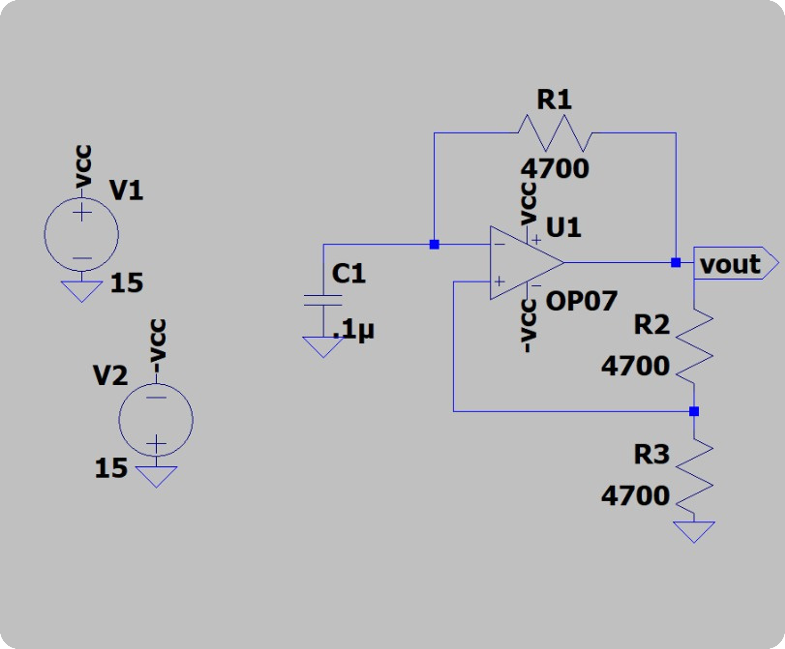
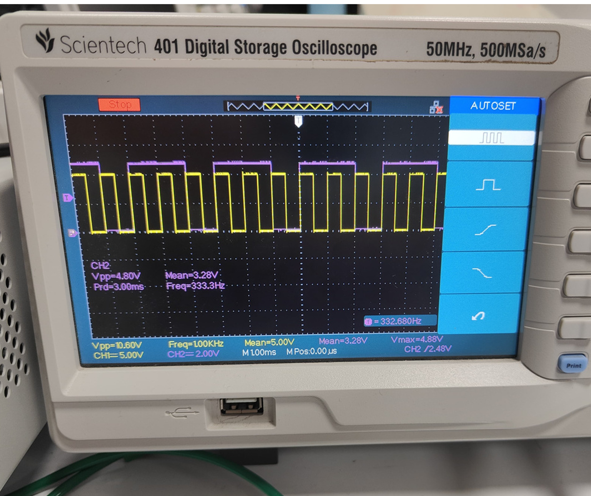

# Transistor-Level D Flip-Flop with Integrated Clock Generator

This repository documents the design, simulation, and hardware implementation of an edge-triggered D flip-flop built from discrete transistors, along with a custom-built astable multivibrator clock circuit using an operational amplifier.

---

### 🔍 Project Overview

The primary goal of this project was to demonstrate a fundamental understanding of digital logic and analog electronics by building a sequential logic element—the D flip-flop—from the ground up using basic components. The project involved designing the flip-flop circuit, creating a stable clock source, simulating the behavior, and validating the final hardware implementation on a breadboard.

---

### 🎯 Key Objectives

-   **Design an Optimized D Flip-Flop:** Move beyond a gate-based implementation to create a more efficient D flip-flop using a minimal number of BJT transistors.
-   **Engineer a Stable Clock Source:** Build a 1 kHz astable multivibrator to provide a reliable clock signal for the flip-flop.
-   **Simulate and Validate:** Use LTspice to simulate the circuit's behavior and then verify the hardware prototype's functionality with an oscilloscope.

---

### ⚙️ Circuit Design and Schematics

The final circuit consists of two main stages: the D flip-flop and the clock generator.

#### 1. D Flip-Flop (3-BJT Design)
Instead of a complex design requiring 10-11 transistors for individual logic gates, an optimized architecture based on an SR latch was implemented using only **three BC547B (NPN) BJT transistors**. This design minimizes component count and potential sources of error.

`

#### 2. Astable Multivibrator (Op-Amp Clock)
An astable multivibrator was engineered using an **LM741 Op-Amp** to generate a stable **1 kHz square wave**. This design was chosen after an initial BJT-based multivibrator produced a clock signal with insufficient amplitude and poor frequency stability. The Op-Amp version provided a reliable and clean clock signal.

`

---

### 🔬 Results & Validation

The integrated circuit was successfully built and tested on a breadboard. The functionality was validated using an oscilloscope, which confirmed that the D flip-flop correctly captured the data input (`Vin`) on the rising edge of the 1 kHz clock signal and held it until the next clock pulse.

#### Output Waveform
The oscilloscope readings showed the expected behavior: the output (`Vout(Purple)`) follows the input (`Vin`) (which is square wave having 2khz frequency with 70% Duty cycle for clear demonstration), the change happens only at Positive edege of the (`clock(Purple)`).

`

#### BreadBoard Implementation

`

---

### 🔧 Tech Stack & Components

**Software:**
-   **LTspice:** For circuit simulation and waveform analysis.

**Hardware Components:**
-   BC547B (NPN BJT Transistors)
-   LM741 Operational Amplifier
-   Resistors & Capacitors
-   Breadboard & Jumper Wires
-   Oscilloscope & Power Supply

---

### 📁 Files Included

-   `Design a D-flip flop using transistors.pdf` – The complete project presentation with schematics, methodology, and results.
-   `Schematics` - Folder Containing the Circuit schematics of D-flipflop and Astable multivibrator clock.
  
---

### 🧠 Key Learnings

-   **Component-Level Design:** Gained practical experience in designing digital logic circuits from discrete analog components.
-   **Circuit Optimization:** Learned to move from a theoretical gate-based model to a more efficient, component-minimized design.
-   **Problem-Solving:** Successfully diagnosed and solved the clock signal instability issue by replacing the initial BJT multivibrator with a more robust Op-Amp-based solution.
-   **Simulation vs. Reality:** Developed skills in using simulation tools like LTspice to predict circuit behavior before validating it on physical hardware.
